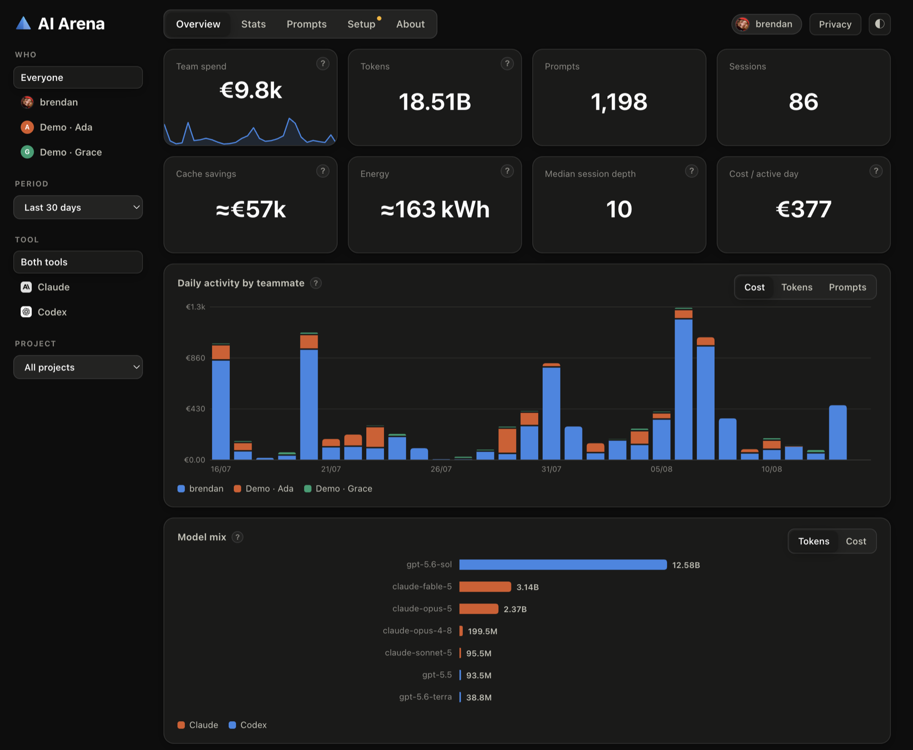
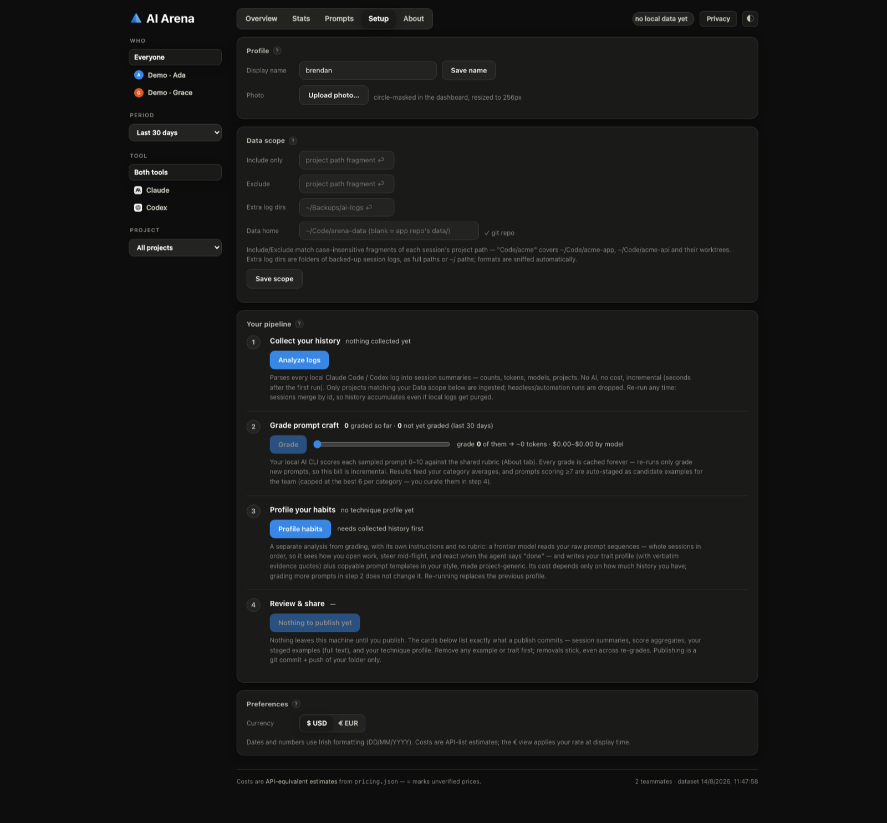

# AI Arena

**Learn from your team's AI power users.** Arena analyses each teammate's local
Claude Code and Codex session logs, works out what the usage would cost at API list
prices, grades prompt craft with a local AI against a shared [rubric](RUBRIC.md),
and profiles how each person actually drives their agents — then gives the team a
dashboard to compare styles, steal techniques, and copy each other's best prompts.

**[Try the live demo →](https://superdangerous.net/demos/ai-arena/)** — the full
dashboard with two synthetic teammates, read-only, nothing to install.



## The question it answers

Given the same tools and similar experience, why is teammate X more effective with
AI than teammate Y? Leaderboards can't tell you. Arena gets at it three ways:

- **Deterministic habit metrics** — words per prompt, session depth and reuse,
  compaction habits, reasoning-effort mix per model, cache efficiency, rhythm.
- **AI-graded prompt craft** — every sampled prompt scored 0–10 against a
  category-specific rubric where an 11-word bug report with precise anchors can
  beat a 500-word essay, and trivial asks can't inflate the average.
- **Habit profiles** — a frontier model reads whole sessions *in order* (how
  someone opens work, steers mid-flight, reacts when the agent claims "done") and
  writes an evidence-backed technique profile plus **copyable prompt templates in
  that person's voice**, with project specifics replaced by `<placeholders>`.

## Requirements

- **Node 18+** — check with `node --version`; install from [nodejs.org](https://nodejs.org)
  (macOS: `brew install node`). Arena tells you if your Node is too old.
- **git** — for sharing data with your team (analysis works without it).
- **An AI CLI you already use** — [Claude Code](https://claude.com/claude-code) or
  [Codex CLI](https://developers.openai.com/codex/cli). Either works; this is both
  the *source* of the session logs Arena analyses and the *engine* for grading and
  profiling. No API keys are handled by Arena — it shells out to your logged-in CLI.

## Get started

```bash
git clone https://github.com/SuperDangerous/ai-arena.git
cd ai-arena
node arena.js serve
```

That's it — everything else happens in the dashboard, which opens with two demo
teammates so you can explore before adding your own data (the same pair as the
[hosted demo](https://superdangerous.net/demos/ai-arena/)). Head to the **Setup**
tab and work top to bottom:



1. **Profile** — your display name and a photo (the photo is *copied* into your
   data folder, resized to 256px; the original is never referenced again).
2. **Data scope** — two decisions before your first analysis:
   - **Data home**: where your dataset lives. Leave blank to keep it inside this
     repo, or — recommended for teams — point it at a **separate private git
     repo** (e.g. `~/Code/ai-arena-data`, cloned from your org). Every read,
     write, avatar, and publish commit follows this setting.
   - **Include list**: which projects may enter your dataset. Nothing outside it
     is ever ingested.
3. **Your pipeline** — four steps with live state and honest cost estimates:
   **Collect** (parse local logs — free, incremental, seconds after the first
   run) → **Grade** (score prompts against the rubric; slider + token/cost
   estimate before you commit to anything) → **Profile** (the deep habits read) →
   **Review & share** (see exactly what a publish commits, item by item, remove
   anything, then one click to commit & push).

If something's missing, Arena says so rather than failing: no logs yet → it names
the CLIs and where their logs live; no AI CLI → Grade/Profile show install links;
data home isn't a git repo → publishing is disabled with instructions. Prefer the
terminal? Every step has a CLI equivalent (below).

## Team setup: a shared data repo

Keep the tool public and your data private:

```bash
git clone https://github.com/your-org/ai-arena-data.git ~/Code/ai-arena-data
# then in Setup → Data scope → Data home: ~/Code/ai-arena-data
```

Teammates run Arena at whatever cadence they like — sessions merge by id, so
patchy monthly runs still accumulate into one coherent history per person, even
when local logs get purged in between. `git pull` in the data repo brings in
everyone who has published.

## What gets shared (and what doesn't)

| Shared via `«data home»/<you>/` | Never shared |
|---|---|
| Per-session **summaries**: counts, tokens by model, project names, timing | Chat transcripts, tool output, file contents |
| **Aggregate** prompt scores per category | Ungraded prompt texts (local cache only) |
| Your **best prompts** (score ≥ 7, best 6 per category), full text | Anything outside your include list |
| Your **habit profile** + copyable templates | `.arena/` config & caches |
| Profile: display name, avatar, machines, first/last activity | Removed examples & traits (parked locally) |

Nothing leaves a machine until its owner presses publish (or runs
`node arena.js publish`), and the review surface lists every item that would ship.

## CLI reference

```text
init      --user <name> [--avatar ] [--data-dir <path>]
scan      [--add <path>]                  discover log sources; add backups
analyze   [--days N]                      parse logs (incremental; resumes grown files)
          [--include S] [--exclude S]     project whitelist / blacklist (persisted)
          [--force] [--clear-include]
grade     [--days N] [--sample N]         AI-grade prompts via your local CLI
          [--grader claude|codex] [--model <id>]
habits    [--budget <chars>]              AI technique profile from prompt sequences
serve     [--port N] [--no-open]          dashboard at http://localhost:4177
publish   [--dry-run] [--yes]             review + commit + push your data
demo      [--remove]                      add/remove the demo teammates
```

Logs are found automatically in `~/.claude/projects`, `~/.codex/sessions` (and
`archived_sessions`), including the 2025 flat rollout format and dirs relocated
via `CLAUDE_CONFIG_DIR` / `CODEX_HOME`. Backup mirrors are opt-in
(`scan --add`), duplicates de-duplicate by session id, and grown append-only
logs resume from a stored byte offset — warm re-analyses take well under a second.

## Honest numbers

- **Cost is API-equivalent** at list prices from the editable
  [`pricing.json`](pricing.json) — read it as *value extracted*, not money spent.
  Unverified model prices are flagged and render with ≈.
- **Grading** runs through whichever CLI you have, defaulting to its strongest
  model — on a 250-prompt benchmark two frontier graders agreed with each other
  at r = 0.86 while a budget model ran ~1.5 points harsher and noisier. Every
  grade is cached forever, so scores never drift.
- **Energy** is shown as a clearly-marked rough estimate (no vendor publishes
  per-token energy); the Wh-per-million-token factors are editable.

See [ARCHITECTURE.md](ARCHITECTURE.md) for the data flow, file formats, and the
parser edge-case ledger (replayed subagent threads, headless-CLI detection,
injected-context guards, dedupe claims — real logs are messy).

## Repo layout

```
arena.js          CLI entry
lib/              parsers, pricing, grading, habits, server, store
web/              the dashboard (vanilla JS + hand-rolled SVG, no build step)
web/kit/          reusable dashboard kit — tokens, components, charts, shell
                  (domain-neutral; see web/kit/README.md to reuse it elsewhere)
pricing.json      editable price + energy factors
RUBRIC.md         the grading rubric
ARCHITECTURE.md   internals
data/demo-*/      demo teammates (safe to delete)
```

## License

[MIT](LICENSE)
